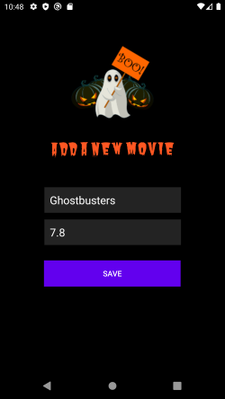
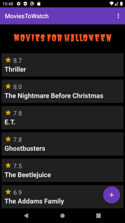

# Halloween Movies: Android Room and MVVM
This application allows user to add halloween movies to his/her
watch list. By creating this simple app, my aim is to implement MVVM
architecture and practice Android Room.

During the implementation process, I firstly created an entity class which
defined the database table scheme. I created a data access object (DAO)
interface for the database operations such as insert, update etc.

Once the entity and DAO has been created, I created an abstract class for the
movie database which extends from RoomDatabase. In this class in order to
get an instance of the database, singleton is used.

At this point, I created a movie repository and implemented methods. I
used AsyncTask for some operations such as insert. Once the repository
is implemented, I created a ViewModel class and implemented necessary
methods here as well. This class contains my LiveData.

On main activity, I get an instance of ViewModel and with the help of LiveData
I observe the data changes. Whenever the data changes, recycler view acts
accordingly to display the movie list.

## Screenshots

Main screen is where the added movies are shown. If user does not have any
prior movies in the list, the screen will show up empty. In order to display
movies on this screen, recycler view is used.

User clicks the add button and a new activity shows up. On this activity,
user provides a movie name and movie point out of 10 (if desired) and clicks
the save button in order to save the movie to his/her watch list.

Recycler view on the main activity is updated with the LiveData changes.
As a side note, movies in the list are displayed by their movie points in
descending order.

